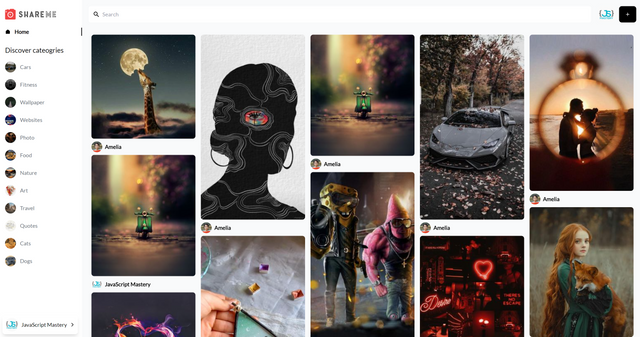

# ShareMe Memory

## [Live Demo](https://sharemememory.netlify.app)

## This is a social media application:

1. User can **create**, **edit**, **delete** and **save** posts with photos and comments

2. It enabled features such as **like** and **comment** on other people's posts with **searching** and **filtering** images functions

3. It integrated **Google Authentication API** to support users’ login with Google account

This app is inspired by following: [here](https://www.youtube.com/watch?v=1RHDhtbqo94&t=7091s)

## Tech Stack

**Frontend**: React, TailwindCSS

**Backend**: Sanity 

**Deployment platform**: Netlify